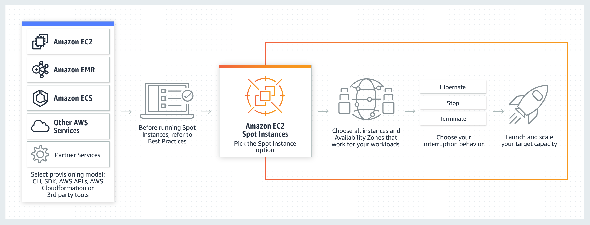

# AWS GCR Spot Workshop

Amazon EC2 Spot 实例让您可以利用 AWS 云中未使用的 EC2 容量。与按需实例的价格相比，使用 Spot 实例最高可以享受 90% 的折扣。

您可以将 Spot 实例用于各种无状态、容错或者灵活的应用程序，例如大数据、容器化工作负载、CI/CD、Web 服务器、高性能计算 (HPC) 以及测试和开发工作负载。Spot 实例与 Auto Scaling、EMR、ECS、CloudFormation、Data Pipeline 和 AWS Batch 等 AWS 服务紧密集成，因此您可以选择如何启动和维护 Spot 实例上运行的应用程序。

此外，您还可以轻松地将 Spot 实例与按需实例和 RI 结合使用，从而进一步优化工作负载的成本和性能。得益于 AWS 的运行规模，Spot 实例可以在运行超大规模工作负载时实现规模并节省成本。

在 AWS GCR Spot Workshop 中，我们将与您一起探索 Spot 实例的运作模式与最佳实践。

更多 Spot 相关信息，可参考 [https://aws.amazon.com/cn/ec2/spot/](https://aws.amazon.com/cn/ec2/spot/)

---
## Spot 实例的特色

**1. 可预测的低价格**

Spot 实例的价格最多可以比按需实例低 90%。此外，您可以使用 EC2 Auto Scaling 同时在 Spot、按需实例和 RI 中预置容量，以便优化工作负载的成本和性能。

**2. 大规模**

Spot 实例可以为您提供 AWS 大规模运行的优势。您可以在运行超大规模工作负载的同时节省大量成本，也可以通过运行并行任务来加快工作负载的处理速度。

**3. 易于使用**

通过 EC2 Auto Scaling 和 ECS 等 AWS 服务或者 Terraform 和 Jenkins 等集成的第三方工具，您可以轻松启动、扩展和管理 Spot 实例。

---
## Spot 实例运作模式

---
## Spot 实例适用场景

**1. 大数据和分析**

用 Spot 实例搭配 Amazon EMR、Hadoop 或 Spark 来处理海量数据，快速处理大数据与机器学习工作负载。

**2. 容器化工作负载**

容器通常无状态并且有容错能力，非常适合 Spot 实例。您可以在 Spot 实例上创建 Amazon ECS、Amazon EKS 或自主管理的 Kubernetes 集群，以便运行任何规模的容器化工作负载。

**3. CI/CD 与测试**

CI/CD 工作负载有容错能力，可以利用 Spot 实例实现的成本节省。您可以使用 EC2 Spot 队列插件，在 AWS 云中快速而经济高效地启动 CI/CD 管道。

**4. Web 服务**

使用 Spot 实例以低成本在流量高峰期间保持最佳 Web 性能。您可以在负载均衡器后面部署一组 EC2 实例，使用 EC2 Auto Scaling 将其扩展到数万个 Spot 实例。

**5. 图像和媒体渲染**

媒体和娱乐工作室可以使用 Spot 实例扩展本地部署或云基础设施，以近乎无限的容量满足项目和时间表要求，从而经济高效地管理渲染工作负载。

**6. 高性能计算**

加快松散耦合或并行 HPC 工作负载（例如基因组学测序和算法交易）的速度。您可以将 Spot 实例与 AWS Batch 等其他 AWS 服务共同用于运行 HPC 工作负载。 

