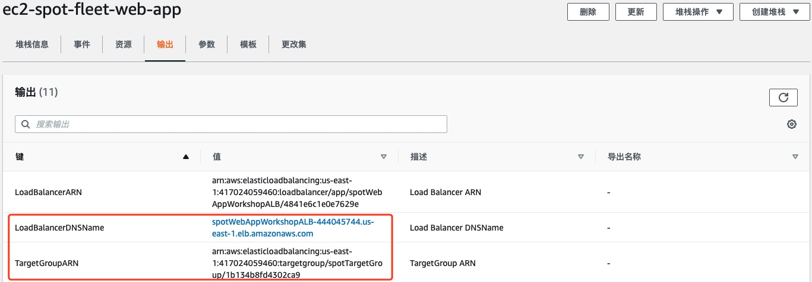

# 使用 CloudFormation 创建资源

为了节省实验环境的初始化过程，我们使用 CloudFormation 模板去创建 应用负载均衡器 ALB， VPC 和两个在不同可用区的子网，安全组，以及实验所需要的 IAM policy 和 Role。

1. 首先下载 CloudFormation 的模板文件，然后创建 Stack

```
wget https://raw.githubusercontent.com/nwcd-samples/gcr-spot-workshop/master/resource/ec2-spot/ec2-spot-fleet-web-app.yaml
```

```	
aws cloudformation create-stack --stack-name ec2-spot-fleet-web-app --template-body file://ec2-spot-fleet-web-app.yaml --capabilities CAPABILITY_IAM
```

2. 查询 CloudFormation 当前创建结果

```
aws cloudformation describe-stacks --stack-name ec2-spot-fleet-web-app --query 'Stacks[0].{StackStatus:StackStatus}'
```

等待 CloudFormation Stack 的状态变为 CREATE_COMPLETE 后，再继续实验的后续步骤
	

	
	
使用 CLI 命令查询 ALB 的 ARN 和 DNS Name, 把结果保存下来
	
```
aws cloudformation describe-stacks --stack-name ec2-spot-fleet-web-app --query 'Stacks[0].Outputs[?OutputKey==`LoadBalancerARN` || OutputKey==`LoadBalancerDNSName`].{Key:OutputKey,Value:OutputValue}' 
```
	
也可以从 CloudFormation 的界面中查询 ARN 和 DNS Name
	


