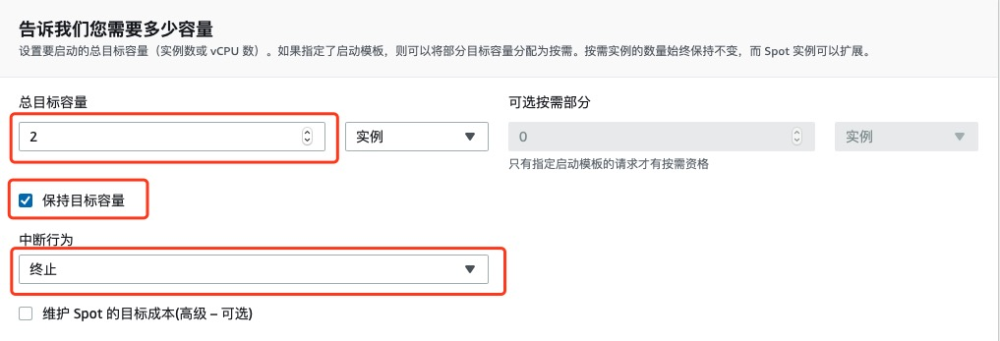
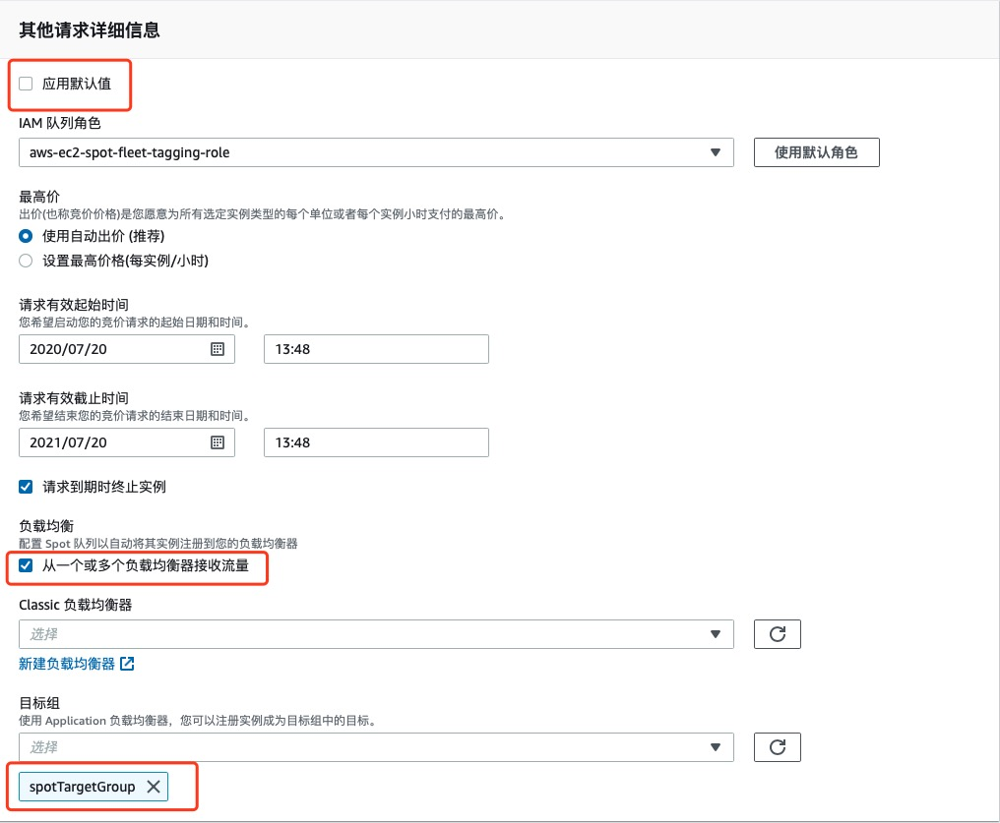

# 创建 EC2 Fleet

在这一部分，我们会启动一个 EC2 Spot Fleet ，并且将使 Spot 实例自动地与之前创建的负载均衡相关联。

1.	在 EC2 的控制台导航面板中，选择 **Spot 请求**

2.	点击 **请求竞价型实例**


3.	在**告诉我们您的应用程序或任务需要**面板中，选择**负载均衡工作负载**，其他使用默认设置。

4.	在**配置实例**面板中，**AMI** 选择 Amazon Linux 2 AMI(HVM)，**最小计算单位**选择 c3.large.  控制台会使用这些选项，并在满足最小计算单位的前提下，尽可能多的去申请不同的 EC2 实例类型。

5.	在**网络**面板中，在 **VPC** 选项内，选择被 CloudFormation 所创建的对应的 VPC, 应该是叫 **EC2 Spot Fleet web app workshop**. 然后，在**可用区**选项内，选择与之前建立的 ALB 负载均衡器相同的可用区和子网


7.	展开 **附加配置** 选项，在**安全组**配置内，选择 **default**


8.	在**用户数据**配置中，把以下文本粘贴进去：

```
#!/bin/bash
yum -y update
yum -y install httpd
chkconfig httpd on
wget -P /var/www/ http://ec2-18-139-160-6.ap-southeast-1.compute.amazonaws.com/site.tar.gz
tar zxvf /var/www/site.tar.gz -C /var/www/
service httpd start
```


9 .您需要创建一个 Tag，**创建标签**，**键**设置为 loadBalancerTargetGroup，**值**设置为 TargetGroup 的 ARN，并勾选**实例**选项，点击**创建**


10.在**告诉我们您需要多少容量**面板中，把**总目标容量**设置为 2，**可选按需部分**保持默认值 0。选中**保持目标容量**，**中断行为**选择**终止**。



11.在**队列请求设置**中，您会看到推荐的实例类型，**取消**勾选**应用建议**可以对容量池进行自定义。本次实验我们选择建议的所有实例类型。

12 .在队列分配策略，选择**在我的队列中的实例池之间呈现多样化**。这个选项会尽量启动尽可能多的实例类型。


13 .在**其他请求详细信息**面板中，**取消**点选**应用默认值**。勾选**从一个或多个负载均衡器接受流量**。在**目标组**下拉列表中，选择之前创建的目标组。


<!--14 .在页面的最下方，可以看到**您的队列请求概览**面板，这里描述了Spot请求的信息，队列强度，预估价格，与按需实例比较所节省的成本等。您也可以点击**JSON配置**按钮去下载一个JSON文件。您也可以使用这个配置文件以AWS CLI的方式去启动Spot Fleet.-->

14 .点击**启动**。

15 .可以在 Spot 请求控制台中看到 Spot Fleet 的请求。您会看到 2 个 Spot 实例正在被请求。

16 .回到 EC2 控制台中的**目标群组**面板，选择您的**目标组**，在**目标**标签栏内会看到 Spot 实例**已经被注册**。
