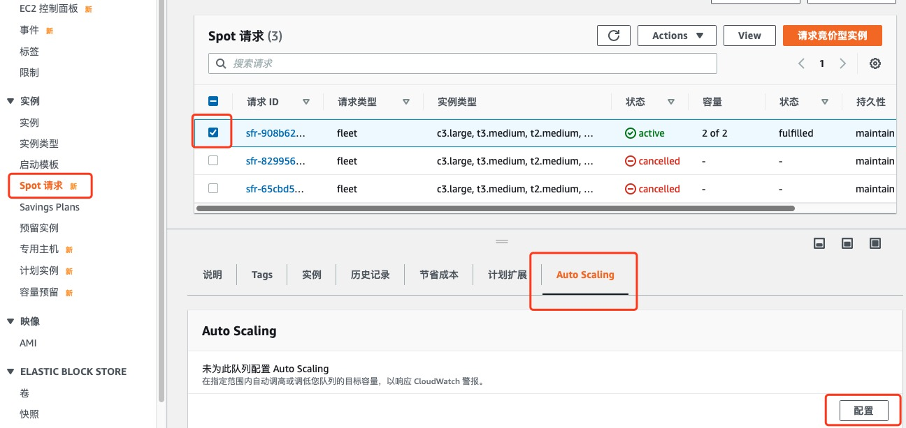
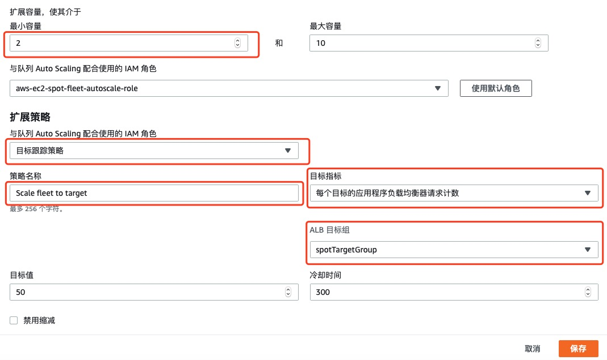

# 为 Spot Fleet 配置 Auto Scaling

下面，我们将为 Spot Fleet 配置 Auto Scaling。他将基于 ALB 负载均衡器的请求数量，自动进行扩缩容。

1.	在 EC2 控制台中，选择 **Spot 请求**面板

2.	勾选您刚刚启动的 **Spot 请求 ID**

3.	在屏幕下方出现的详情页面内，选择 **Auto Scaling** 选项卡，点击**配置**按钮

4.	现在可以配置 Spot Fleet 如何扩缩容。在扩展容量中，最小容量和最大容量设置为 2 和 10 之间。

5.   修改**策略名称**，改为 Scale fleet to target

6.	在**扩展策略**中，修改**目标指标**为每个目标的应用程序负载均衡器请求计数。

7.	在 **ALB 目标组**中，选择之前创建的目标组。

8.	其他选项保留默认值。

9.	点击**保存**

现在，Spot Fleet 就会根据请求的波峰自动进行扩容。