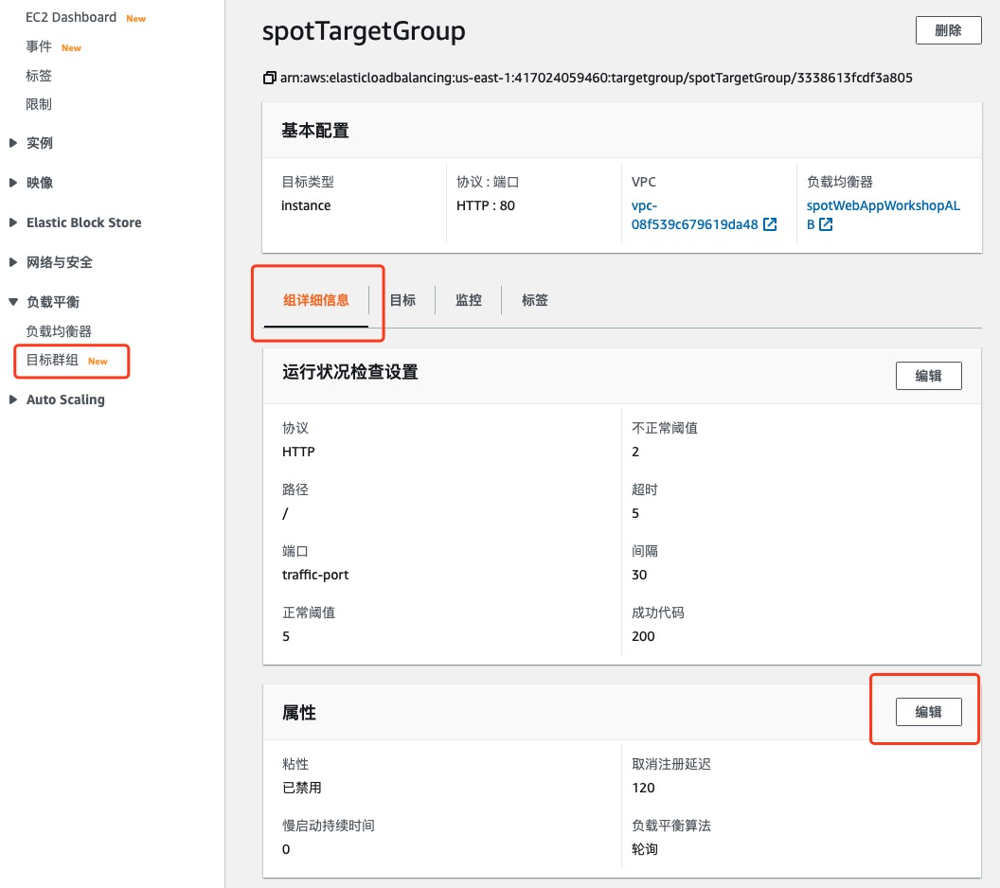

# Spot 实例中断配置

使用 Lambda 函数处理 Spot 实例中断的通知消息
我们可以使用 Spot 实例提前 2 分钟的中断通知功能，去把 EC2 实例从负载均衡的目标组中移除，当把实例从目标组中移除时，负载均衡上的连接进入 Draining 状态。

1.	在 EC2 控制台的导航面板中，选择**目标群组**

2.	点击进入您的**目标组**

3.	在下方的**组详细信息**面板中，滚动屏幕到最下方会看到**属性**面板，点击**编辑**



4.	修改**取消注册延迟**的数值为 120 秒，点击**保存更改**<br>
为了捕获 Spot 实例发送到 CloudWatch Events 的中断通知, 我们会使用之前在 CloudFormation 中创建的与两个目标关联的规则。这两个目标分别是 Lambda 函数和 SNS topic。

5.	在 AWS 管理控制台中，跳转到 **Lambda 控制台**

6.	找到并选择之前使用 CloudFormation 创建的 Lambda 函数 **ec2-spot-fleet-web-app-lambdaFunction**

7.	滚动屏幕到**函数代码**面板，用以下代码替换当前的 index.py 中的内容：

```
import boto3
def handler(event, context):
  instanceId = event['detail']['instance-id']
  instanceAction = event['detail']['instance-action']
  try:
    ec2client = boto3.client('ec2')
    describeTags = ec2client.describe_tags(Filters=[{'Name': 'resource-id','Values':[instanceId]},{'Name':'key','Values':['loadBalancerTargetGroup']}])
  except:
    print("No action being taken. Unable to describe tags for instance id:", instanceId)
    return
  try:
    elbv2client = boto3.client('elbv2')
    deregisterTargets = elbv2client.deregister_targets(TargetGroupArn=describeTags['Tags'][0]['Value'],Targets=[{'Id':instanceId}])
  except:
    print("No action being taken. Unable to deregister targets for instance id:", instanceId)
    return
  print("Detaching instance from target:")
  print(instanceId, describeTags['Tags'][0]['Value'], deregisterTargets, sep=",")
  return
```

8 . 点击**保存**

CloudWatch Event 的详细信息会被发送到 Lambda 函数中，然后这个函数使用 boto3 进行 AWS API 的调用。第一个调用是获取 EC2 的 Tag 信息，并过滤关键字 ’TargetGroupArn’. 如果找到这个 Tag, 则从此目标组中移除该实例。
