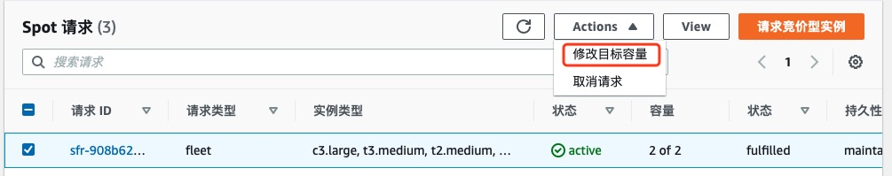

# Spot 实例中断测试

测试 Spot 实例的中断通知
Spot Fleet 对 Spot 实例进行的任何中断操作，都会让 Spot 实例本身获取到中断通知。我们可以利用这一点进行 Spot 中断测试。因此，我们只需要将 Spot Fleet 的目标大小从 2 减少到 1 即可。被中断的实例会收到 Spot 实例中断通知。

1.	在 EC2 控制台的导航面板中，选择 **Spot 请求**

2.	勾选您的 Spot Fleet 请求

3.	点击上方的 Actions 下拉列表，选择**修改目标容量**

4.	设置**新目标容量**为 1，点击**提交**。这会把 Spot Fleet 的请求目标从 2 变为 1

5.	我们可以看一下 Lambda 函数产生效果。在 EC2 控制台的导航面板选择**目标群组**

6.	选择您的**目标组**

7.	点击**目标**选项卡

8.	稍等片刻，您应该会看到已被注册的目标中的其中一个已经被移除(可能需要多刷新几次)；也可以在 EC2 界面上看到有一个 Spot 实例正在被终止。
同时，由于我们在第 4 步为 Spot Fleet 配置了 Auto Scaling 并设置最小容量为 2 个实例，因此 Spot Fleet 会在其中一个 Spot 实例被移除之后，再重新申请和创建新的 Spot 实例。

<!--### **配置SNS topic**
如果时间允许，可以去配置SNS topic给您发送邮件通知. 这个SNS topic之前已经被CloudFormation创建好了， 他也是Spot实例中断事件所触发的CloudWatch Event的目标之一。-->
