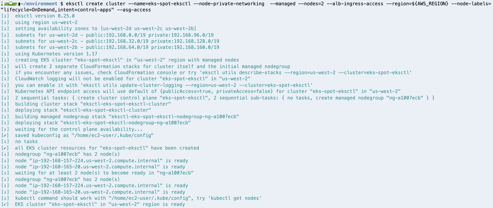
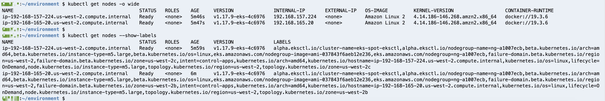

# 创建 EKS 集群

在创建 EKS 集群之前，我们还需要安装 eksctl 和 kubectl 工具。

---
## 安装 kubectl

```
sudo curl --silent --location -o /usr/local/bin/kubectl \
  https://amazon-eks.s3.us-west-2.amazonaws.com/1.17.7/2020-07-08/bin/linux/amd64/kubectl

sudo chmod +x /usr/local/bin/kubectl
```

验证 kubectl 安装结果：

```
kubectl version
```

---
## 安装 eksctl

[eksctl](https://eksctl.io/) 是 Amazon EKS 的官方管理工具, Go 语言实现, 底层通过 CloudFormation 对 AWS 资源进行管理。

安装命令:

```
curl --silent --location "https://github.com/weaveworks/eksctl/releases/latest/download/eksctl_$(uname -s)_amd64.tar.gz" | tar xz -C /tmp

sudo mv -v /tmp/eksctl /usr/local/bin
```

验证 eksctl 安装结果:

```
eksctl version
```

---
## 生成 SSH KEY

通过 ssh-keygen 命令生成 ssh key. 新生成的 ssh key 用于后续登录 EKS 的工作节点(连续点击三次回车键接受默认生成配置):

```
ssh-keygen
```

用刚刚生成的 key pair 中的 public key 生成 EC2 key pair

```
aws ec2 import-key-pair --key-name "eks-spot-key" --public-key-material fileb://~/.ssh/id_rsa.pub
```

---
## 通过 eksctl 创建 EKS 集群

下面的命令会创建一个名字为 eks-spot-eksctl 的 EKS 集群, 同时会创建一个托管的工作节点组, 里面包含两个 on-demand 类型的 EC2 实例类型. 同时, 新的 VPC 会在这个过程中创建, 里面会包含 3个 公共子网和 3 个私有子网. 工作节点组中的工作节点会位于新创建的 VPC 的私有子网中.

```
eksctl create cluster --name=eks-spot-eksctl --node-private-networking  --managed --nodes=2 --alb-ingress-access --region=${AWS_REGION} --node-labels="lifecycle=OnDemand,intent=control-apps" --asg-access
```

整个 EKS 集群创建过程大约 15 分钟, 如果一切顺利, 如下图所示:



验证集群工作状态:

```
kubectl get nodes -o wide
kubectl get nodes --show-labels
```



获取工作节点角色, 用于后续实验过程使用(注意在如下命令中参数 --cluster 和 --cluster-name 处输入 EKS cluster 对应的集群名称)

```
NODE_GROUP_NAME=$(eksctl get nodegroup --cluster eks-spot-eksctl -o json | jq -r '.[].Name')
ROLE_NAME=$(aws eks describe-nodegroup --cluster-name eks-spot-eksctl --nodegroup-name $NODE_GROUP_NAME | jq -r '.nodegroup["nodeRole"]' | cut -f2 -d/)
echo "export ROLE_NAME=${ROLE_NAME}" >> ~/.bash_profile
```


