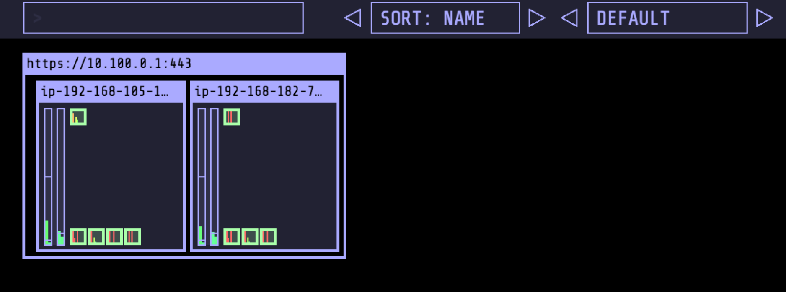
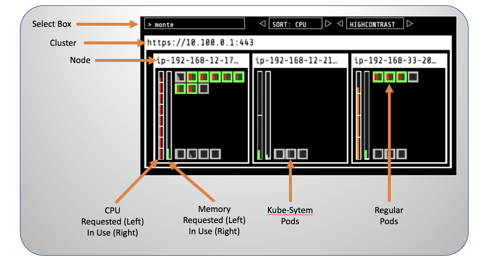

# 部署 kube-ops-view

[kube-ops-view](https://github.com/hjacobs/kube-ops-view) 对 EKS 集群中的系统资源运行状况提供了一个运维视图. 其主要提供了对 Kubernetes 集群中的工作节点以及工作节点之上的 Pod 运行状态提供了信息监控和视图展现。

安装 kube-ops-view 命令如下.  安装过程会主要创建 LoadBalancer Service 以及 RBAC 相关权限. 其中创建的负载均衡器用于从外部访问 kube-ops-view 服务.

```
helm repo update
helm install stable/kube-ops-view \
--name kube-ops-view \
--set service.type=LoadBalancer \
--set nodeSelector.intent=control-apps \
--set rbac.create=True
```

安装成功系统会显示如下信息.

```
...
NOTES:
To access the Kubernetes Operational View UI:
1. First start the kubectl proxy:
   kubectl proxy
2. Now open the following URL in your browser:
   http://localhost:8001/api/v1/proxy/namespaces/default/services/kube-ops-view/
Please try reloading the page if you see "ServiceUnavailable / no endpoints available for service", pod creation might take a moment.
...
```

执行如下命令验证 kube-ops-view 对应的 chart 是否成功安装.

```
helm list
```

安装成功系统会显示如下信息.

```
NAME            REVISION        UPDATED                         STATUS          CHART                   APP VERSION     NAMESPACE
kube-ops-view   1               Fri Jul  3 01:05:44 2020        DEPLOYED        kube-ops-view-1.2.0     20.4.0          default  
```

获取  kube-ops-view 对应的外部访问 URL.

```
kubectl get svc kube-ops-view | tail -n 1 | awk '{ print "Kube-ops-view URL = http://"$4 }'
```

在浏览器中打开上述获取的链接.



关于 kube-ops-view 中元素模型的一些解释.

