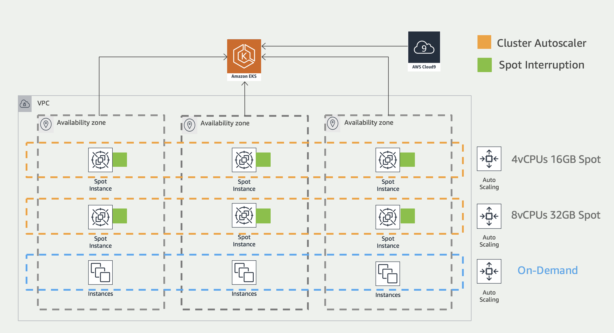
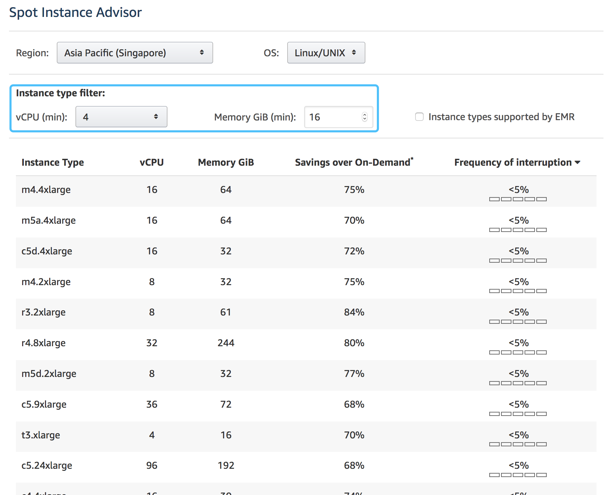
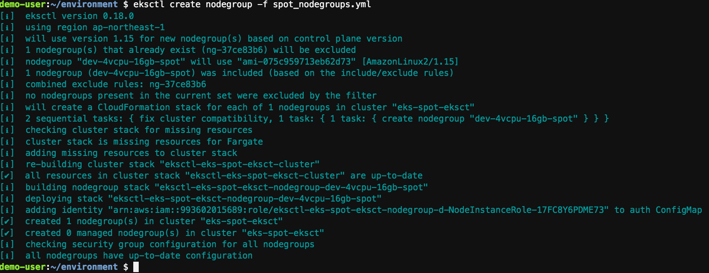
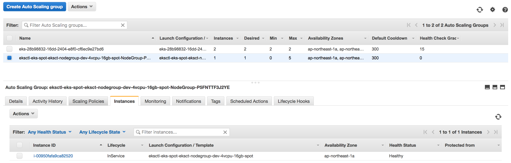
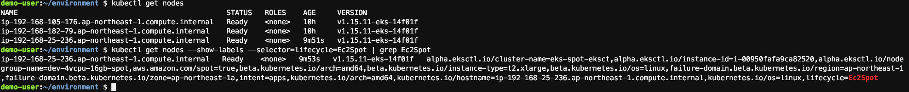
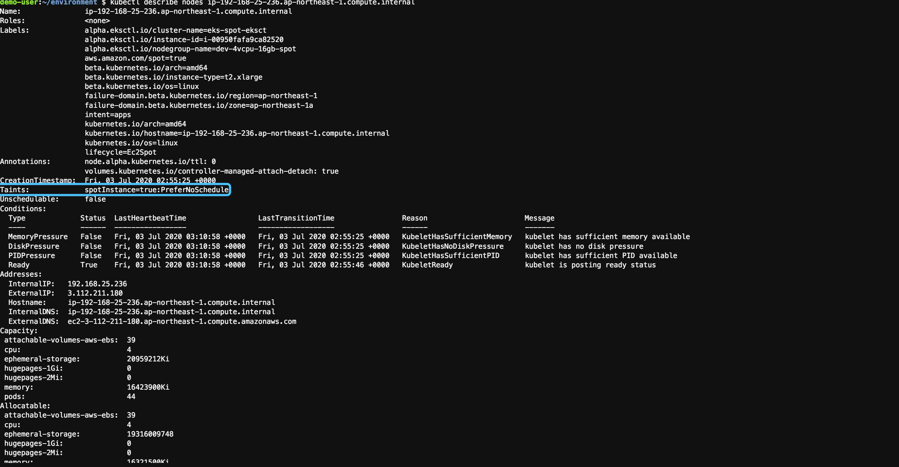

# 创建和配置 Spot 工作节点组

EC2 Spot 的资源状态可以通过 [Spot Instance Advisor](https://aws.amazon.com/ec2/spot/instance-advisor/) 获取. 通过 Cluster Autoscaler 对  Spot 工作节点组对应的ASG进行资源弹性管理.  Spot 工作节点组中的 EC2 实例类型必须具备相同的 CPU:MEM 配置. 可以通过两种方式实现: 每个 Spot 工作节点组中配置一种 EC2 实例类型; 或者每个 Spot 工作节点组中配置不同的 EC2 实例类型但是具有同样的 CPU:MEM 的配置.


系统资源架构图：

 

Spot Instance Advisor视图：



执行如下命令生成 Spot 工作节点组模板。 (注意: 在 metadata --> name 处填写对应的 EKS 集群名称; 在 nodeGroups --> ssh --> publicKeyName 处填写上述步骤创建的 key 的名字.)

```
cat <<EoF > ~/environment/spot_nodegroups.yml
apiVersion: eksctl.io/v1alpha5
kind: ClusterConfig
metadata:
    name: eks-spot-eksct
    region: $AWS_REGION
nodeGroups:
    - name: dev-4vcpu-16gb-spot
      minSize: 0
      maxSize: 5
      desiredCapacity: 2
      instancesDistribution:
        instanceTypes: ["m5.xlarge", "m5d.xlarge", "m4.xlarge","t3.xlarge","t3a.xlarge","m5a.xlarge","t2.xlarge"] 
        onDemandBaseCapacity: 0
        onDemandPercentageAboveBaseCapacity: 0
        spotAllocationStrategy: capacity-optimized
      ssh:
        allow: true
        publicKeyName: eks-spot-key
      labels:
        lifecycle: Ec2Spot
        intent: apps
        aws.amazon.com/spot: "true"
      taints:
        spotInstance: "true:PreferNoSchedule"
      tags:
        k8s.io/cluster-autoscaler/node-template/label/lifecycle: Ec2Spot
        k8s.io/cluster-autoscaler/node-template/label/intent: apps
        k8s.io/cluster-autoscaler/node-template/label/aws.amazon.com/spot: "true"
        k8s.io/cluster-autoscaler/node-template/taint/spotInstance: "true:PreferNoSchedule"
      iam:
        withAddonPolicies:
          autoScaler: true
          cloudWatch: true
          albIngress: true
EoF
```

执行如下命令创建 Spot 工作节点组。整个节点组的创建过程大约在 3 分钟左右。

```
eksctl create nodegroup -f spot_nodegroups.yml
```

Spot 工作节点组创建完毕后, eksctl 视图信息如下：



Spot 工作节点组创建完毕后, ASG 视图信息如下：



Spot 工作节点组创建完毕后, 执行如下kubectl命令：

```
kubectl get nodes
kubectl get nodes --show-labels --selector=lifecycle=Ec2Spot | grep Ec2Spot
```

Spot 工作节点组创建完毕后, kubectl 命令视图信息如下：



执行如下命令获取 Spot 工作节点信息。 (注意: "ip-192-168-25-236.ap-northeast-1.compute.internal" 为通过上一步的 kubectl 获取的 Spot 实例信息.)

```
kubectl describe nodes ip-192-168-25-236.ap-northeast-1.compute.internal
```

Spot 实例的 Taint 信息如下：


