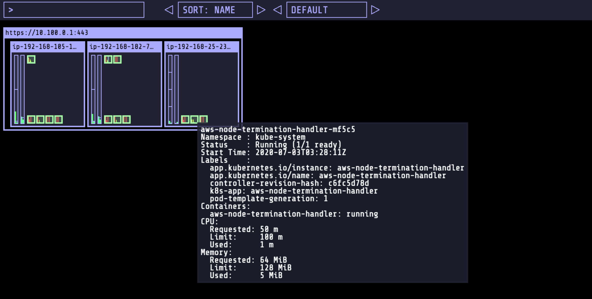

# 配置 aws-node-termination-handler 组件

[aws-node-termination-handler](https://github.com/aws/aws-node-termination-handler) 一般会部署在 EKS 集群中的 Spot 工作节点实例上。其会监听 EC2 的 metadata 服务，当 Spot 工作节点实例被回收时候, 在系统被回收的两分钟之内会告知 Kubernetes 的控制平面对当前节点执行 [Taint](https://kubernetes.io/docs/concepts/scheduling-eviction/taint-and-toleration/) 操作实现对当前节点停止执行新的 POD 的调度, 以及执行 [Drain](https://kubernetes.io/docs/tasks/administer-cluster/safely-drain-node/) 操作进行当前节点上 POD 的迁移操作。另外, aws-node-termination-handler 还可以对 AWS EC2 的系统[维护事件](https://docs.aws.amazon.com/AWSEC2/latest/UserGuide/monitoring-instances-status-check_sched.html)进行类似处理操作。

执行如下命令部署 aws-node-termination-handler.

```
helm repo add eks https://aws.github.io/eks-charts
helm install --name aws-node-termination-handler \
             --namespace kube-system \
             --set nodeSelector.lifecycle=Ec2Spot \
             eks/aws-node-termination-handler
```

执行如下命令验证  aws-node-termination-handler 对应的 POD 部署在 Spot 实例类型工作节点。

```
kubectl get daemonsets --all-namespaces
```

在 kube-ops-view 进行验证：

