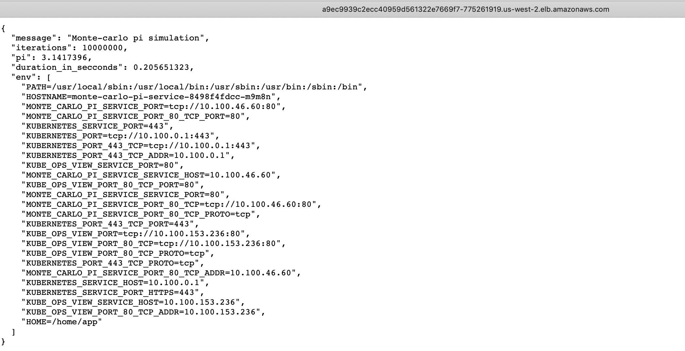

# 部署示例应用

本节将部署 [Monte Carlo Pi](https://github.com/ruecarlo/eks-workshop-sample-api-service-go) 示例应用

---
## 创建示例应用部署模板

执行如下命令创建示例应用部署模板

```
cat <<EoF > ~/environment/monte-carlo-pi-service.yml
---
apiVersion: v1 
kind: Service 
metadata: 
  name: monte-carlo-pi-service 
spec: 
  type: LoadBalancer 
  ports: 
    - port: 80 
      targetPort: 8080 
  selector: 
    app: monte-carlo-pi-service 
--- 
apiVersion: apps/v1 
kind: Deployment 
metadata: 
  name: monte-carlo-pi-service 
  labels: 
    app: monte-carlo-pi-service 
spec: 
  replicas: 2 
  selector: 
    matchLabels: 
      app: monte-carlo-pi-service 
  template: 
    metadata: 
      labels: 
        app: monte-carlo-pi-service 
    spec:
      tolerations: 
      - key: "spotInstance" 
        operator: "Equal" 
        value: "true" 
        effect: "PreferNoSchedule" 
      affinity: 
        nodeAffinity: 
          preferredDuringSchedulingIgnoredDuringExecution: 
          - weight: 1 
            preference: 
              matchExpressions: 
              - key: lifecycle 
                operator: In 
                values: 
                - Ec2Spot 
          requiredDuringSchedulingIgnoredDuringExecution: 
            nodeSelectorTerms: 
            - matchExpressions: 
              - key: intent 
                operator: In 
                values: 
                - apps 
      containers: 
        - name: monte-carlo-pi-service 
          image: ruecarlo/monte-carlo-pi-service
          resources: 
            requests: 
              memory: "512Mi" 
              cpu: "1024m" 
            limits: 
              memory: "512Mi" 
              cpu: "1024m" 
          securityContext: 
            privileged: false 
            readOnlyRootFilesystem: true 
            allowPrivilegeEscalation: false 
          ports: 
            - containerPort: 8080

EoF
```

---
## 部署示例应用

执行如下命令部署示例应用：

```
kubectl apply -f ~/environment/monte-carlo-pi-service.yml
```

执行如下命令验证示例应用已经部署在 EKS 集群中的 Spot 工作节点组上：

```
nodes=$(kubectl get nodes --selector=intent=apps | tail -n +2 |  awk '{print $1}')
for node in $nodes; do echo $node; kubectl describe nodes $node | grep "monte-carlo-pi-service"; done 
```

---
## 访问示例应用

执行如下命令获取示例应用对应的外部访问链接。

```
kubectl get svc monte-carlo-pi-service | tail -n 1 | awk '{ print "monte-carlo-pi-service URL = http://"$4 }'
```

示例应用访问界面如下：




执行如下命令对示例应用进行命令行访问。这里可以尝试改变服务调用的 iterations 参数来改变示例应用的工作端负载。

```
URL=$(kubectl get svc monte-carlo-pi-service | tail -n 1 | awk '{ print $4 }')
time curl ${URL}/?iterations=100000000
```
