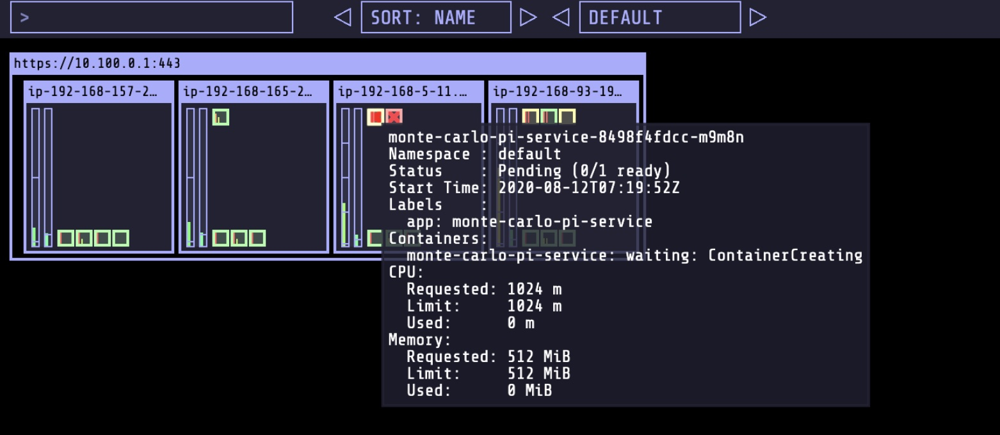

# 模拟 Spot 实例中断


## 部署 ec2-spot-termination-simulator

[ec2-spot-termination-simulator](https://github.com/Shogan/ec2-spot-termination-simulator) 提供了对 EC2 metadata service 的模拟能力。这使得用户在 Spot 实例不被真实发生回收的情况下，模拟测试 Spot 实例中断对客户应用的影响。同时，也可以对 EC2 metadata service 中的中断信号有依赖的系统服务进行模拟测试, 比如 aws-node-termination-handler 组件，验证其是否可以很好的处理中断事件。

---
### 1. 登录 Spot 工作节点并检查中断信息


通过 kube-ops-view 获取 Spot 类型工作节点组中某一个 Spot 实例的私有 IP，在 AWS 服务控制台中的 EC2 服务中通过搜索 Spot 实例私有 IP 定位 Spot 实例，最终获取其公网 DNS 地址。


通过 **创建 EKS 集群** 步骤中创建的SSH key，SSH 登录当前 Spot 实例。示例命令如下：

```
ssh ec2-user@ec2-44-234-45-74.us-west-2.compute.amazonaws.com
```


检查 Spot 工作节点中断信息


检查当前 Spot 工作节点的 metadata service 的中断信息。 我们可以看到，在 AWS EC2 Spot 实例在没有被回收的情况下，中断信息 URL 返回 404。

```
curl -i  http://169.254.169.254/latest/meta-data/spot/instance-action
```

---
### 2. 部署 ec2-spot-termination-simulator

在 Cloud9 终端环境中, 通过如下命令生成 ec2-spot-termination-simulator 部署模板，通过 tolerations 和 affinity 使得 ec2-spot-termination-simulator 只部署在当前 Spot 工作节点实例上。

```
cat <<EoF > ~/environment/ec2-spot-termination-simulator.yml
apiVersion: apps/v1
kind: Deployment
metadata:
  labels:
    app: ec2-spot-termination-simulator
  name: spot-term-simulator
spec:
  progressDeadlineSeconds: 600
  replicas: 1
  revisionHistoryLimit: 10
  selector:
    matchLabels:
      app: ec2-spot-termination-simulator
  strategy:
    rollingUpdate:
      maxSurge: 25%
      maxUnavailable: 25%
    type: RollingUpdate
  template:
    metadata:
      labels:
        app: ec2-spot-termination-simulator
    spec:
      tolerations: 
      - key: "spotInstance" 
        operator: "Equal" 
        value: "true" 
        effect: "PreferNoSchedule" 
      affinity: 
        nodeAffinity: 
          preferredDuringSchedulingIgnoredDuringExecution: 
          - weight: 1 
            preference: 
              matchExpressions: 
              - key: lifecycle 
                operator: In 
                values: 
                - Ec2Spot 
          requiredDuringSchedulingIgnoredDuringExecution: 
            nodeSelectorTerms: 
            - matchExpressions: 
              - key: intent 
                operator: In 
                values: 
                - apps
      containers:
      - image: shoganator/ec2-spot-termination-simulator:1.0.1
        imagePullPolicy: Always
        name: spot-term-simulator
        env:
        - name: PORT
          value: "80"
      dnsPolicy: ClusterFirst
      restartPolicy: Always
      terminationGracePeriodSeconds: 1
---
apiVersion: v1
kind: Service
metadata:
  labels:
    app: spot-term-simulator
  name: ec2-spot-termination-simulator
spec:
  ports:
  - name: http
    port: 8082
    protocol: TCP
    targetPort: 80
  selector:
    app: ec2-spot-termination-simulator
  sessionAffinity: None
  type: NodePort

EoF
```

在 Cloud9 中, 执行如下命令部署 ec2-spot-termination-simulator 服务：

```
kubectl apply -f ec2-spot-termination-simulator.yml 
```

在 kube-ops-view 验证 ec2-spot-termination-simulator 服务已经部署到集群中当前的 Spot 工作节点上。


---
### 3. 更改 Spot 工作节点网络配置以模拟中断信号


在Cloud9中, 执行如下命令获取 ec2-spot-termination-simulator 服务对应的 NodePort 信息, 例如 32752 并记录。

```
kubectl get svc ec2-spot-termination-simulator
```

SSH 登录到当前 Spot 工作节点. 执行如下命令更改系统网络配置, 使得 EC2 metadata service 对应的中断信号访问端点重定向到 ec2-spot-termination-simulator 服务。

注意, 下面命令中的端口号 32752 为上一步中获取的 ec2-spot-termination-simulator 服务对应的 NodePort 信息。

```
sudo ifconfig lo:0 169.254.169.254 up
sudo socat TCP4-LISTEN:80,fork TCP4:127.0.0.1:32752 >/dev/null 2>&1 &
```

切换到 kube-ops-view 视图, 可以看到当前 Spot 工作节点上的 Pod 被驱逐处于等待调度状态。这是因为当前 Spot 工作节点上的 aws-node-termination-handler 组件监听到  ec2-spot-termination-simulator 服务返回的模拟的实例收回信息, 从而通知 EKS 集群的控制平面进行对当前节点执行 cordon 和 drain 操作。 如下图所示：



随后可见被驱逐的 Pod 在另外一台 Spot 实例上被重新创建和运行起来。