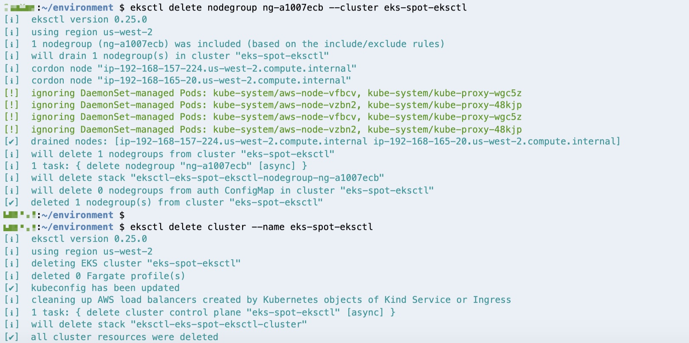

# 资源清理

1.	删除 Spot 工作节点组

```
eksctl delete nodegroup -f spot_nodegroups.yml --approve
```

2.	删除 On-Demand 工作节点组

获取工作节点组信息

```
eksctl get nodegroup --cluster eks-spot-eksctl
```
输出信息示例如下：

```
CLUSTER         NODEGROUP       CREATED                 MIN SIZE        MAX SIZE        DESIRED CAPACITY        INSTANCE TYPE   IMAGE ID
eks-spot-eksctl ng-a1007ecb     2020-08-12T06:33:57Z    2               2               2                       m5.large
```

记录 NodeGroup ID 如 ng-a1007ecb，通过 eksctl 删除
```
eksctl delete nodegroup ng-a1007ecb --cluster eks-spot-eksctl
```

3. 删除 EKS 集群

```
eksctl delete cluster  --name eks-spot-eksctl
```


