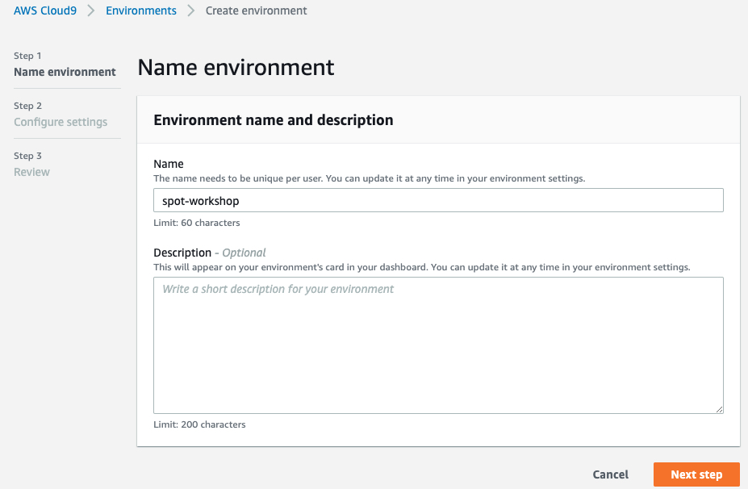
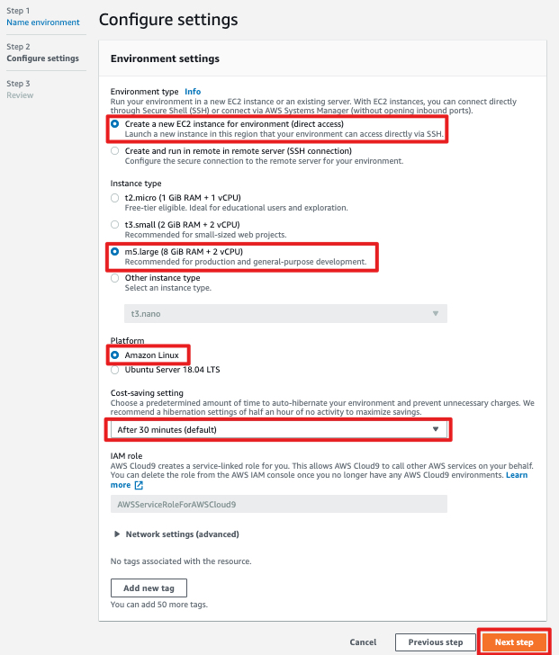
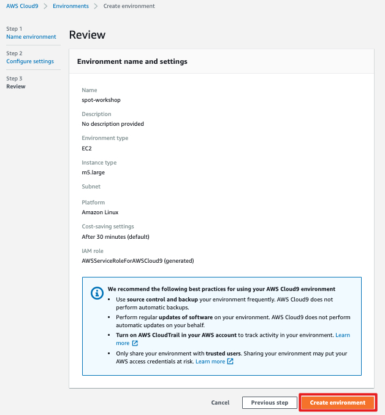
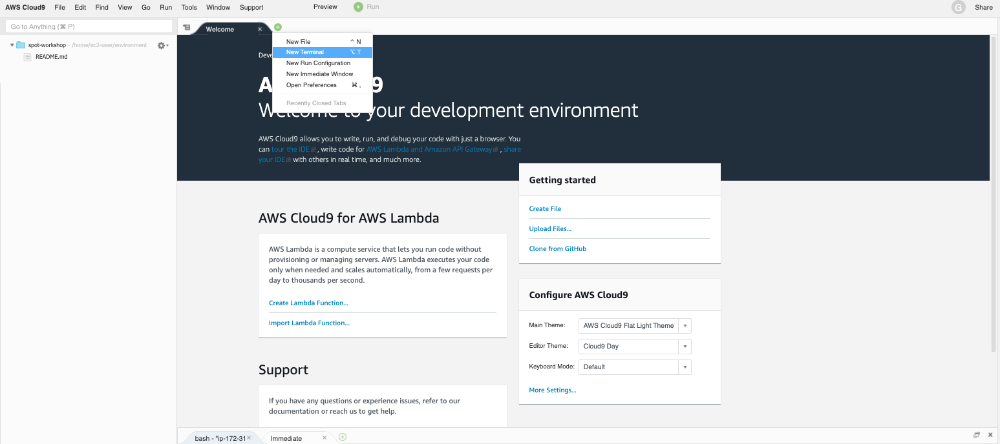
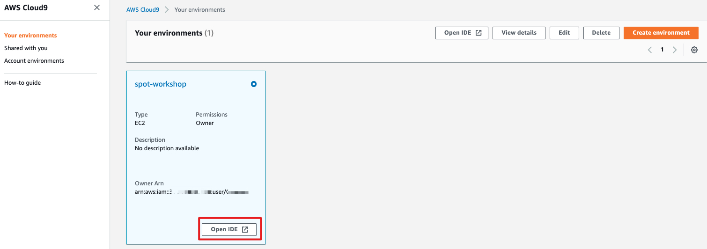

# 创建 Cloud9 环境

使用 AWS 用户登录: [https://us-west-2.console.aws.amazon.com/cloud9/home?region=us-west-2](https://us-west-2.console.aws.amazon.com/cloud9/home?region=us-west-2). 
请将 AWS Region 切换成您的 Workshop 使用的区域。

创建 Cloud9 环境, 步骤如下面截图所示:

[步骤-1]

[步骤-2]

[步骤-3]

创建完成后，会自动进入 Cloud9 IDE 环境：

如果退出 IDE 之后要再进入 Cloud9 环境，可以在 Cloud9 界面上点击 Open IDE 按钮：

