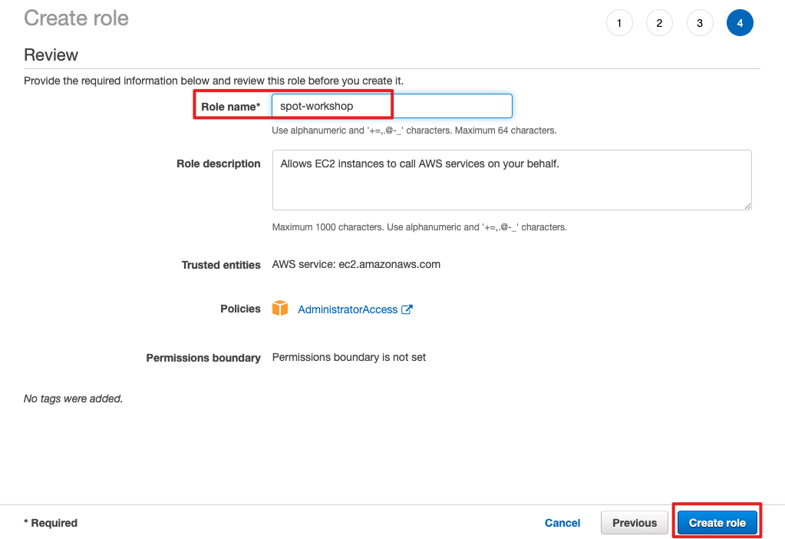

# 创建 IAM Role

1.  在 AWS Console 选择 IAM 服务

2. 选择 AWS service --> EC2, 点击 "Next: Permissions"

3. 选择 "AdministratorAccess" 权限策略

4. 依次选择 “Next: Tags” 和 "Next: Review"

5. 命名角色名称, 比如 "spot-workshop", 然后点击 "Create role"

