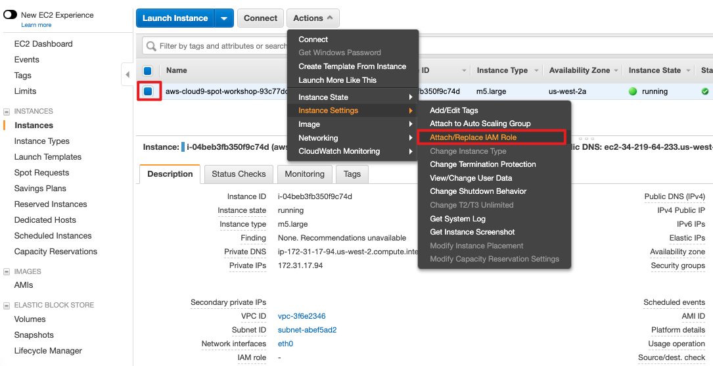
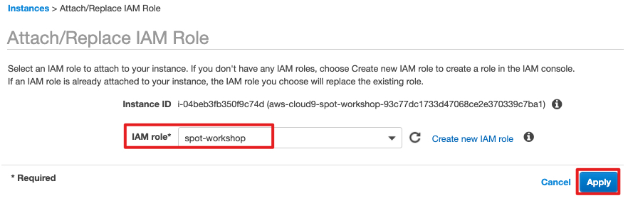

# 添加 IAM Role 至 Cloud9 实例

1. 在 EC2 界面上找到您的 Cloud9 实例

2. 选择 Cloud9 对应的 EC2 实例, 然后选择: Actions --> Instance Settings --> Attach/Replace IAM Role

3. 选择上面创建的角色如 "eks-spot-cloud9", 点击 Apply

4. 更新 Cloud9 默认的 IAM 权限模式

