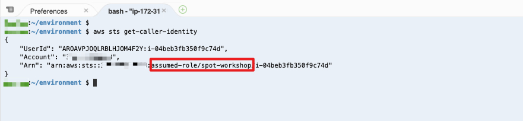

# 更新 Cloud9 环境


删除当前已经保留的 credentials 文件:

```
rm -vf ${HOME}/.aws/credentials
```

配置 AWS CLI 的当前的 region 信息:

```
export ACCOUNT_ID=$(aws sts get-caller-identity --output text --query Account)
export AWS_REGION=$(curl -s 169.254.169.254/latest/dynamic/instance-identity/document | jq -r '.region')

echo "export ACCOUNT_ID=${ACCOUNT_ID}" >> ~/.bash_profile
echo "export AWS_REGION=${AWS_REGION}" >> ~/.bash_profile

aws configure set default.region ${AWS_REGION}
aws configure get default.region
```

验证 Cloud9 已经使用最新的角色关联:

```
aws sts get-caller-identity
```

